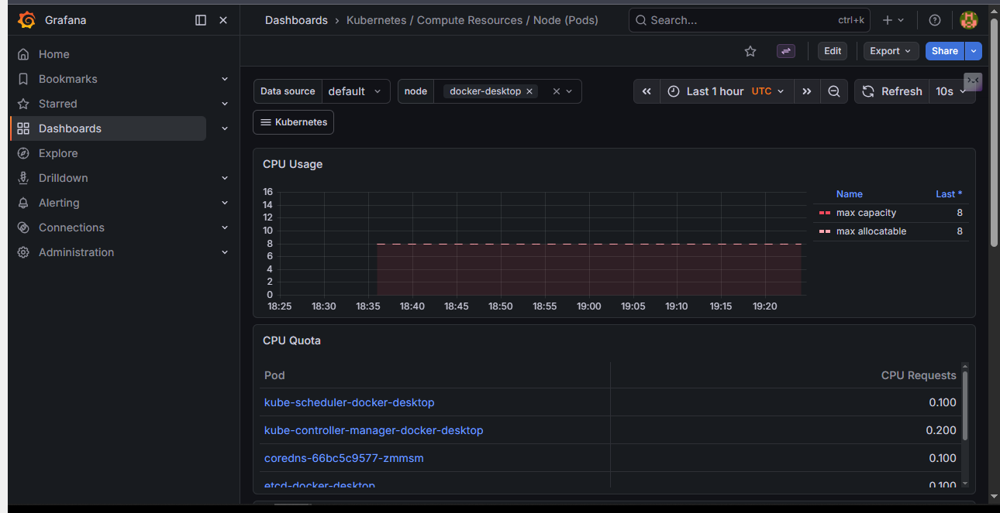
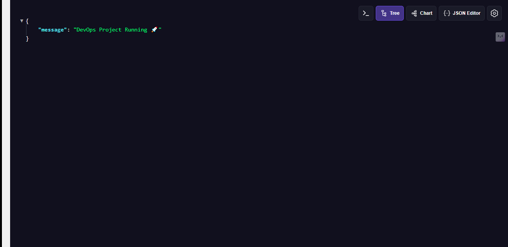
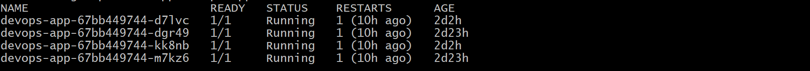

# DevOps Project 1 🚀

## Overview
This project demonstrates an end-to-end DevOps pipeline including CI/CD, containerization, Kubernetes deployment, and infrastructure automation.

## Tech Stack
- FastAPI
- Docker (upcoming)
- Kubernetes (upcoming)
- Terraform (upcoming)

## Status
Day 1: Project setup and FastAPI app created ✅


## Day 2: Dockerization ✅

- Created Dockerfile
- Built container image
- Ran app inside container
- Optimized using .dockerignore

## Day 3: Docker Hub + CI/CD Automation 🚀

### What I did
- Pushed Docker image to Docker Hub
- Created a CI/CD pipeline using GitHub Actions
- Automated Docker image build and push on every commit

### CI/CD Workflow
- Code pushed to GitHub
- GitHub Actions triggers pipeline
- Docker image is built automatically
- Image is pushed to Docker Hub

### Docker Hub Repository
🔗 https://hub.docker.com/r/prateekmall/devops-app

### Key Learning
- Importance of automation in DevOps
- Secure authentication using Docker access tokens
- How CI/CD pipelines eliminate manual work

### Status
CI/CD pipeline successfully building and pushing images ✅

## Day 4: Kubernetes Deployment ☸️

### What I did
- Deployed the application on Kubernetes
- Created a Deployment with 2 replicas
- Exposed the application using a NodePort Service
- Verified service and pod status using kubectl

### Kubernetes Resources
- **Deployment:** `devops-app`
- **Service:** `devops-service`
- **Replicas:** `2`
- **Service Type:** `NodePort`
- **Accessible at:** `http://localhost:30007`

### Commands Used
```bash
kubectl apply -f k8s/
kubectl get pods
kubectl get svc


## Day 5: Scaling and Rolling Updates 🔄

### What I did
- Scaled the Kubernetes deployment from 2 to 4 replicas
- Verified that the application remained accessible during scaling
- Learned how rolling updates work in Kubernetes
- Explored rollout status, rollout history, and rollback commands

### Commands Used
```bash
kubectl scale deployment devops-app --replicas=4
kubectl get pods
kubectl rollout status deployment/devops-app
kubectl rollout history deployment/devops-app
kubectl rollout undo deployment/devops-app


## Day 6: Monitoring with Prometheus & Grafana 📊

### What I did
- Installed Prometheus and Grafana using Helm
- Collected Kubernetes cluster metrics
- Visualized metrics using Grafana dashboards

### Tools Used
- Prometheus (metrics collection)
- Grafana (visualization)
- Helm (deployment)

### Outcome
Cluster metrics like CPU, memory, and pod status are now visible in real-time dashboards.

### Key Learning
- Importance of observability in DevOps
- How Prometheus collects metrics
- How Grafana visualizes system performance

# 🚀 End-to-End DevOps CI/CD Pipeline Project

## 📌 Overview
This project demonstrates a complete DevOps workflow from application development to deployment and monitoring using modern tools.

---

## 🧱 Architecture
GitHub → CI/CD → Docker → Docker Hub → Kubernetes → Monitoring (Prometheus + Grafana)

---

## ⚙️ Tech Stack
- FastAPI
- Docker
- Kubernetes
- GitHub Actions
- Terraform (basic)
- Prometheus
- Grafana

---

## 🔄 CI/CD Workflow
- Code pushed to GitHub
- GitHub Actions builds Docker image
- Image pushed to Docker Hub
- Kubernetes deploys the application

---

## ☸️ Kubernetes Setup
- Deployment with replicas
- NodePort service
- Scaling & rolling updates

---

## 📊 Monitoring
- Prometheus collects metrics
- Grafana visualizes dashboards

---

## 📸 Screenshots




---

## 🚀 Key Features
- Automated CI/CD pipeline
- Containerized application
- Kubernetes deployment with scaling
- Real-time monitoring dashboards

---

## 🧠 Key Learnings
- End-to-end DevOps workflow
- CI/CD automation
- Kubernetes scaling and updates
- Observability and monitoring

---

## 🔗 Links
- GitHub: https://github.com/prateek0007/devops-project-1
- Docker Hub: https://hub.docker.com/r/prateekmall/devops-app


